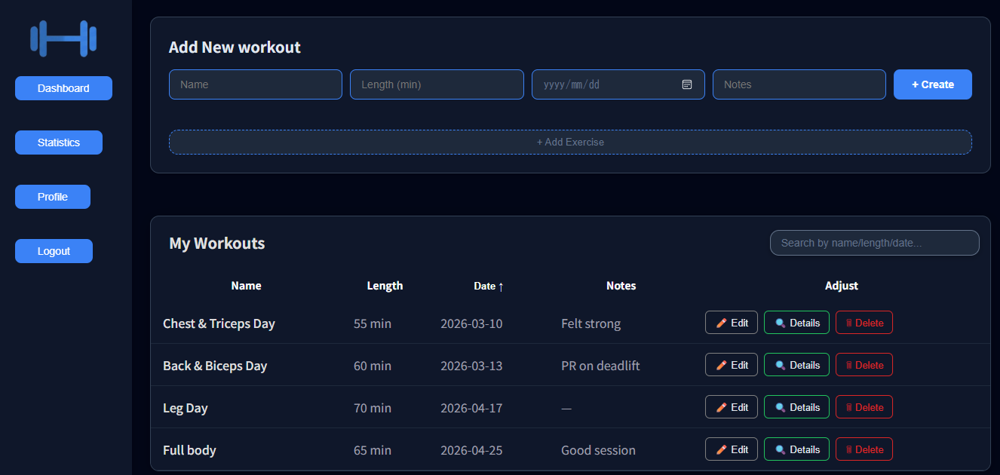
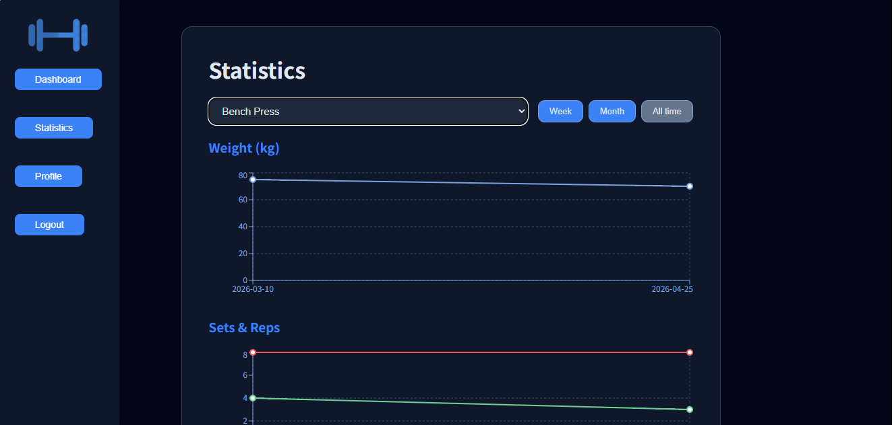
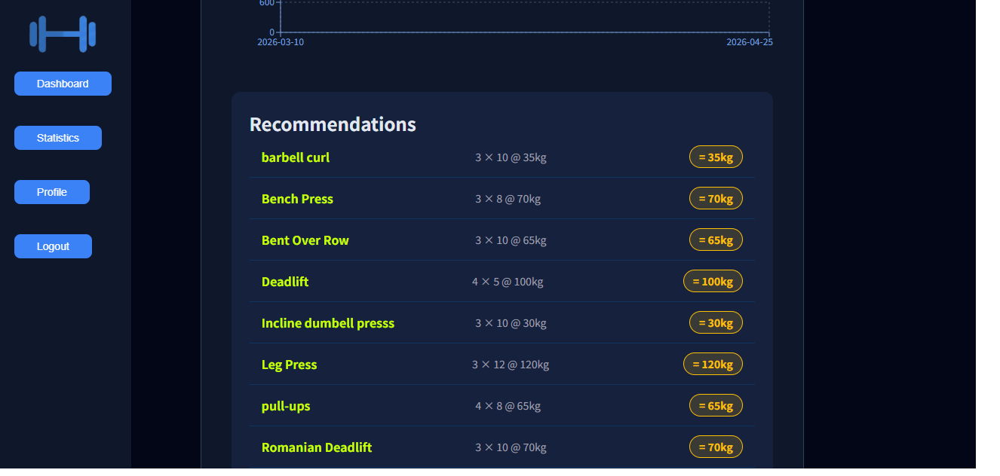
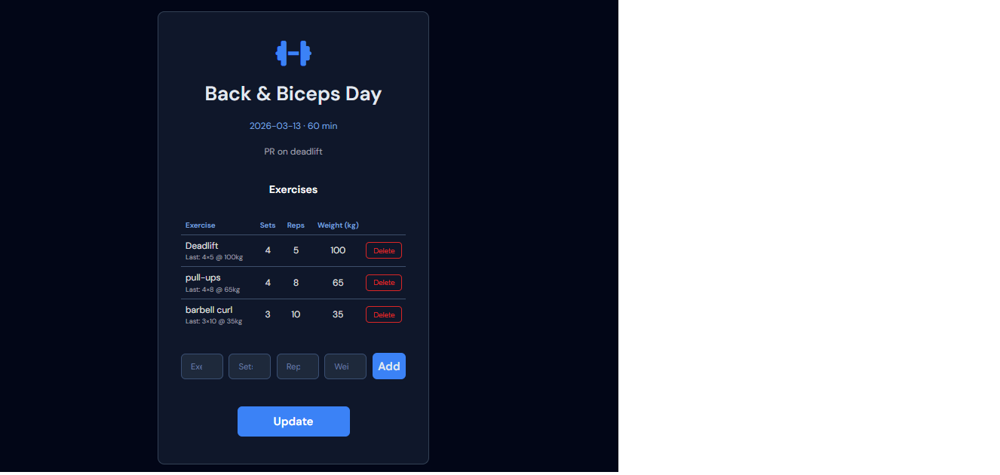

# 💪 Workout Tracker

A full-stack fitness web application for logging workouts, tracking exercise progression, and visualizing training statistics.

---

## 🎯 Purpose

Most fitness apps are either too complex or too simple. Workout Tracker fills the gap — it gives you a clean interface to log what you did, see what you should do next, and understand how you're progressing over time.

---

## 🛠 Tech Stack

| Layer | Technology |
|-------|-----------|
| Frontend | React 18, TypeScript, Vite, Recharts |
| Backend | Java 21, Spring Boot 3, Spring Security |
| Auth | JWT (HttpOnly cookies) |
| Database | PostgreSQL 15 |
| Containerization | Docker, Docker Compose |

---

## ✨ Features

- 🔐 **Authentication** — Register, login, logout, forgot/reset password via email
- 🏋️ **Workout Logging** — Create, edit, delete workouts with exercises (sets, reps, weight)
- 📋 **Exercise Details** — View previous session data inline while training
- 📈 **Statistics** — Weight, sets, reps, and volume charts per exercise with period filters
- 🤖 **Auto Progression** — App recommends weight increases or decreases based on last 3 sessions
- 🔍 **Search & Sort** — Filter workouts by name, length, or date

---

## 📸 Screenshots







## 🚀 Getting Started

### Prerequisites
- Docker & Docker Compose installed

### Setup

```bash
# Clone the repository
git clone https://github.com/Edgarchik-Tatarchik/workout-tracker.git
cd workout-tracker

# Create environment file
cp .env.example .env
# Fill in your values in .env

# Build and run
docker-compose up --build
```

App will be available at `http://localhost`

---

## ⚙️ Environment Variables

Create a `.env` file in the root directory based on `.env.example`:

```
POSTGRES_PASSWORD=your_db_password
JWT_SECRET=your_256bit_secret_key
SPRING_MAIL_USERNAME=your@gmail.com
SPRING_MAIL_PASSWORD=your_gmail_app_password
```

> **Note:** Gmail requires an [App Password](https://myaccount.google.com/apppasswords), not your regular password.

---

## 📁 Project Structure

```
workout-tracker/
├── workout-tracker/          # Spring Boot backend
│   ├── src/
│   └── Dockerfile
├── workout-tracker-frontend/ # React frontend
│   ├── src/
│   └── Dockerfile
├── docker-compose.yml
└── .env.example
```

---

## 🔮 Future Improvements

- [ ] Calorie tracking
- [ ] Workout templates
- [ ] Mobile app (React Native)
- [ ] Social features — share workouts

---

## 👤 Author

**Edgar** — [@Edgarchik-Tatarchik](https://github.com/Edgarchik-Tatarchik)
